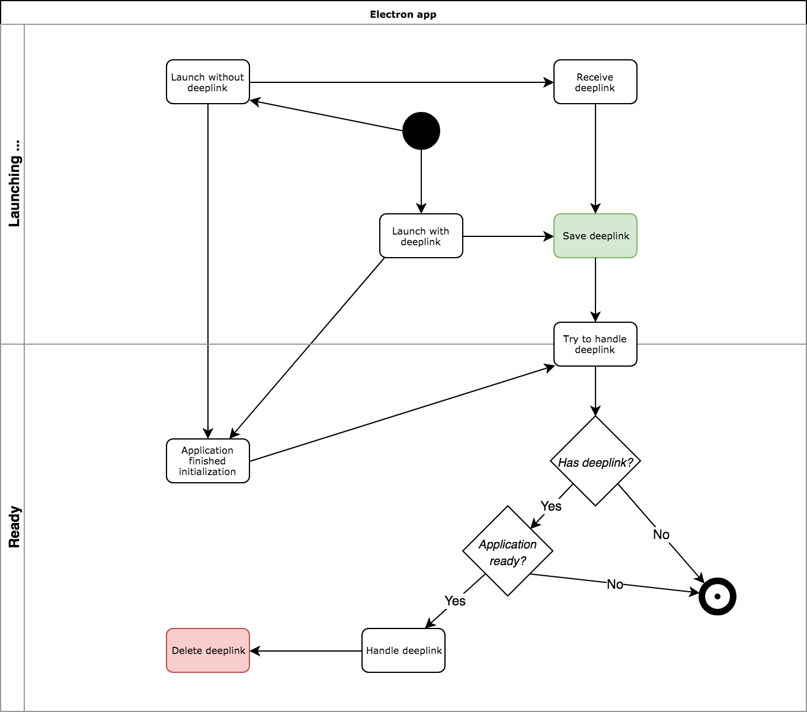

# electron-deeplink

**Clone and run for a quick way to see Electron in action.**

This is a minimal Electron application based on the [Quick Start Guide](https://electronjs.org/docs/tutorial/quick-start) within the Electron documentation.

It handles deeplinks on Windows and macOS for cold and warm start scenarios and was strongly influenced by [https://github.com/oikonomopo/electron-deep-linking-mac-win](https://github.com/oikonomopo/electron-deep-linking-mac-win)

# Usage
## Windows
From a command line prompt run
```
start myapp://?key=abc
```
## macOS
From a terminal run
```
open myapp://?key=abc
```

In both cases you should see similar log statements in the console:
```
open-url: myapp://?key=abc
handleOpenUrl: source: open-url url: myapp://?key=abc
```

# Workflow


## License

[CC0 1.0 (Public Domain)](LICENSE.md)
